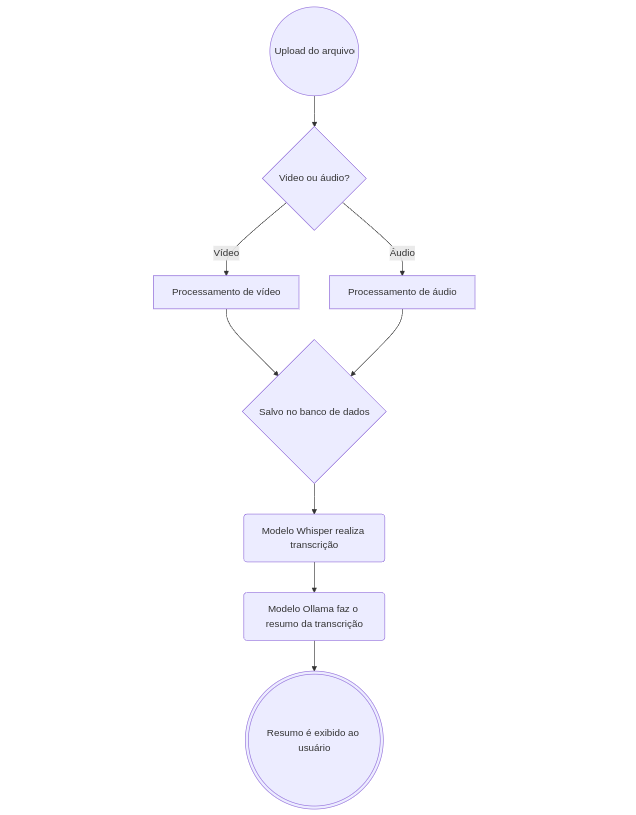

# Apresentação: Engenharia de software - TP1
## Objetivo
A proposta é desenvolver um SaaS com o objetivo de facilitar a vida de profissionais que participam de diversas reuniões e frequentemente esquecem detalhes específicos. Para alcançar esse objetivo, planejamos criar uma solução que receba como entrada um vídeo ou áudio, transcreva o conteúdo e disponibilize o texto gerado para consulta, utilizando inteligência artificial generativa

## Principais features
O sistema proposto oferece uma série de funcionalidades para a gestão eficiente de arquivos de áudio e vídeo. Entre as principais features, destaca-se a capacidade de fazer upload de arquivos de áudio e vídeo, transcrevê-los, resumir o conteúdo e traduzi-lo para outros idiomas. Além disso, o usuário pode salvar, deletar e favoritar os arquivos enviados, garantindo uma organização personalizada. O sistema também permite a exportação das transcrições em formato de legenda, facilitando seu uso em vídeos. Por fim, a plataforma oferece a funcionalidade de registro e login, permitindo ao usuário manter um histórico pessoal de suas atividades.

## Membros da equipe e papeis
- Victor Henrique Silva Ribeiro (Estilização e Front-end)
- Lucca Alvarenga (Front-end)
- Victor Gabriel (Back-end)
- Philipe Dutra (Modelos e banco de dados)

## Tecnologias
**Ferramentas**
- Git
- GitHub
- Swagger
- Docker

**Front-end**
- Frameworks: Angular
- Linguagens: HTML, CSS (com Sass), TypeScript 

**Back-end** 
- Frameworks: Django
- Linguagens: Python

**Banco de dados**
- MongoDB

**Modelos**
- Whisper (transcrição)
- llama (resumo)

# Backlog do produto
- Como usuário, quero ser capaz de me registrar.
- Como usuário, quero ser capaz de fazer login.
- Como usuário, quero ser capaz de fazer upload de um arquivo de áudio/video.
- Como usuário, quero ser capaz de transcrever o áudio/video.
- Como usuário, quero ser capaz de resumir o áudio/video.
- Como usuário, quero ser capaz de traduzir o áudio/video.
- Como usuário, quero ser capaz de salvar os áudios/videos que já mandei.
- Como usuário, quero ser capaz de deletar os áudios/videos que já mandei.
- Como usuário, quero ser capaz de favoritar os meus áudios/videos que já mandei.
- Como usuário, quero ser capaz de exportar as transcrições em formato de legendas.

# Backlog do Sprint #0 (Setup)
## Setup
Tarefas e responsáveis:
- Setup inicial do front-end [Victor Henrique]
- Setup inicial do back-end [Victor Gabriel]
- Setup inicial do banco de dados [Philipe]
- Setup inicial dos modelos [Philipe]

# Backlog do Sprint #1
## 1-Como usuário, quero ser capaz de fazer upload de um arquivo de áudio/video
Tarefas e responsáveis:
- Criar interface de upload [Lucca e Victor Henrique]
- Implementar no front-end a funcionalidade de upload [Lucca]
- Implementar no back-end a recepção e armazenamento do arquivo [Victor Gabriel]
- Implementar no back-end a transcrição de arquivos [Victor Gabriel e Philipe]
- Implementar no back-end o armazenamento da transcrição [Victor Gabriel]
- Implementar no back-end o resumo de arquivos [Victor Gabriel e Philipe]
- Implementar no back-end o armazenamento do resumo [Victor Gabriel]

## 2-Como usuário, quero ser capaz de transcrever o áudio/video
Tarefas e responsáveis:
- Criar opção de transcrição [Lucca e Victor Henrique]
- Gerar feedback visual da transcrição [Lucca e Victor Henrique]
- Criar a visualização da transcrição [Lucca e Victor Henrique]

## 3-Como usuário, quero ser capaz de resumir o áudio/video
Tarefas e responsáveis:
- Criar opção de resumo [Lucca e Victor Henrique]
- Gerar feedback visual do resumo [Lucca e Victor Henrique]
- Criar a visualização do resumo [Lucca e Victor Henrique]

## 4-Como usuário, quero ser capaz de exportar as transcrições em formato de legendas
Tarefas e responsáveis:
- Criar opção de exportação [Lucca e Victor Henrique]
- Implementar no back-end a exportação de transcrição [Victor Gabriel]
- Implementar no front-end download do arquivo contendo a transcrição [Lucca]

# Diagramas UML
## Diagrama de atividades
